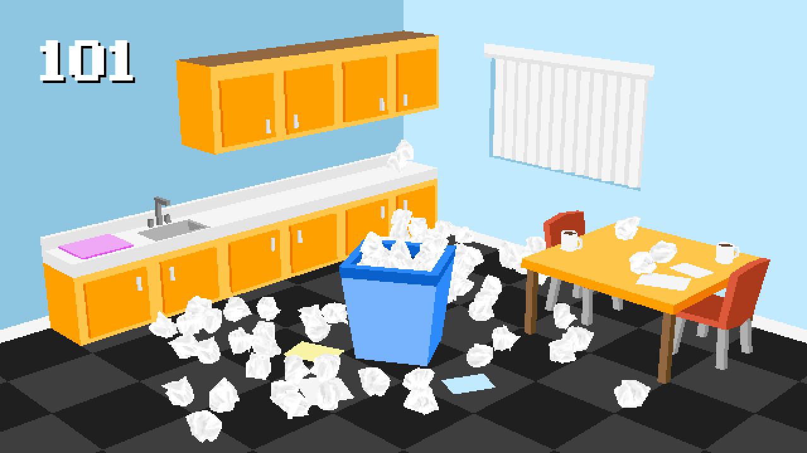

# Resume

Toss Jacob's resume into the trash. Made with React.js (UI), Three.js (3D), and Rapier.js (Physics).

## Screenshots

Gameplay:

## Local Development

 - Install NodeJS package libraries: `npm i`
 - If you get a dependency error, include the `--force` option
 - Run development libraries `npm run dev`
 - Use the link it provides

## Build for release

- Run build with `npm run build` to create a fresh `/dist` folder
- Compress `/dist` folder into a `.zip` file format